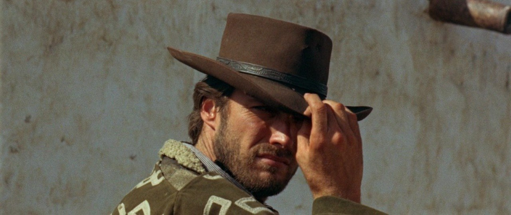
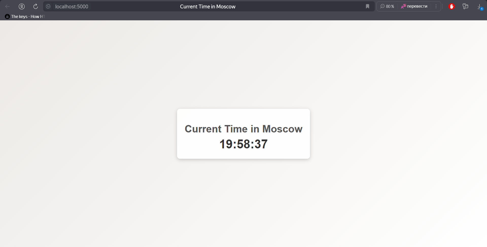

# PyWatch

[](https://github.com/CatOrLeader/S25-core-course-labs/actions/workflows/app_python.yml)

## Overview

How many times you check the time on your laptop and think something like 'O-oh, this kind of boring...'?
Exactly, a lot of times! And now, the time has come... Literally and theoretically. Welcome to the
new era of watches: python web-application watch!

## How to use

* You can start the application locally, by simply adding the `.env` file like this:

```.env
### DEVELOPMENT PROPERTIES ###
FLASK_DEBUG=False

### WEB APPLICATION SETTINGS ###
PORT=5000
```

* And run the command in your CLI (from the `app_python` folder)

```bash
docker build -t python-watch .
docker run -d -p 5000:5000 --name watch python-watch
```

* if you want to stop the application, just type

```bash
docker stop watch
```

Then, start your browser and open `localhost:8080`. Great! You are awesome

## Conclusion

That's all! By this, you receive the _great_ watch on your laptop, not the boring ones you have
in the bottom-right corner.



## Example



## Docker

I added this section at the end to make it easier to track changes. (Please do not reduce my points for the unstructured
README.md.)

---

### How to Build?

* **Quick Answer**: Execute the following script in the same folder as the Dockerfile:

  ```bash
  docker build -t python-watch -f distroless.Dockerfile .
  ```

* **Enhanced Answer**: There are numerous arguments you can use. Check each one by running `docker build --help`. Here
  are my favorites:

  * `-f, --file string`: Specify the name of the Dockerfile (default: "PATH/Dockerfile").
  * `--label stringArray`: Set metadata for an image.
  * `--no-cache`: Do not use cache when building the image (useful when building on different runners).
  * `-t, --tag stringArray`: Name and optionally tag the image (format: "name:tag").

### How to Pull?

* **Quick Answer**: Execute this command from anywhere:

  ```bash
  docker pull catorleader/python-watch:latest
  ```

* **Enhanced Answer**: There are many arguments you can pass to the `docker pull` command, along with the image tag.
  However, I usually use the default one.

### How to Run?

* **Quick Answer**: Execute this command from anywhere:

  ```bash
  docker run -d -p 5000:5000 --name watch catorleader/python-watch:latest
  ```

* **Enhanced Answer**: For this command, there are some necessary variables to pass as CLI arguments:

  * `-d`: Start the container in the background and receive only the container ID in the output (do not follow the
    application logs).
  * `-p`: Publish ports from the container's internal network to the host machine (to access the application
    via `localhost:5000`).
  * `-n, --name`: Assign a name to the container for easier manipulation.
  * `catorleader/python-watch:latest`: The image name you want to start.

## Distroless Image Version

Lightweight image for mostly production use, without tools for debugging and OS components (shell and etc.)

---

### Ver2.0: How to Build?

  ```bash
  docker build -t python-watch:distroless .
  ```

### Ver2.0: How to Pull?

  ```bash
  docker pull catorleader/python-watch:distroless
  ```

### Vet2.0: How to Run?

  ```bash
  docker run -d -p 5000:5000 --name watch catorleader/python-watch:distroless
  ```

---

### Unit Testing

To properly keep the code quality on the significant level, project has covered by an exhausitve set of unit tests.
It is obvious that the project's functionality is not rich enough to create a lot of tests, so it was decided to
keep two different tests for the following functionality:

* Config Loading
* Main Page / Incorrect Page Route loading

---

### CI Workflow

The CI workflow of this application is quite ordinary: there are three main stages, such as

* Lint: Check the application's code quality.
* Test: Assure that the application works correctly.
* Push: Push the latest application image into the GitHub Docker Registry.

The workflow takes place only when a PR is opened to the master/main branch. Why? Because we have a simple project,
and it will be too resource-consuming and messy if we start our jobs on each push to the remote repository (IMO).
In the production environments, there are CI/CD almost every push because companies have self-hosted VMs (runners).
